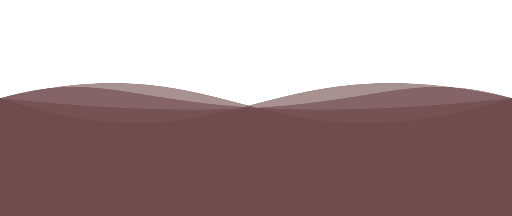

 

<!-- typing svg -->

<!-- badges -->

   

 

---

### :man_technologist: About Me :
I am a Fullstack Software Engineer from Turkey.

 :telescope: I’m working as a Fullstack Software Engineer for building Backend FrontEnd and Mobile Applications  
 :e-mail:  You can contact me at [oguzhanmavii98@gmail.com](mailto:oguzhanmavii98@gmail.com)  
 :seedling: Exploring Technical Content Writing. 
 :zap: In my free time, I solve problems on GeeksforGeeks and read tech articles. 

 :mailbox:How to reach me:   

---
### :hammer_and_wrench: Languages and Tools :

&nbsp;
&nbsp;
&nbsp;
&nbsp;
&nbsp;
&nbsp;
&nbsp;  
&nbsp;

---
### :fire: My Stats :

